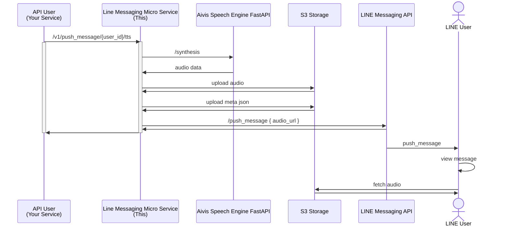

# LineMessagingMicroService

## Overview

- TODO


```mermaid

sequenceDiagram
  participant ApiUser as API User<br/>(Your Service)
  participant LineMessagingMicroService as Line Messaging Micro Service<br/>(This)
  participant AivisSpeechEngineFastAPI as Aivis Speech Engine FastAPI
  participant Storage as S3 Storage
  participant LineMessagingAPI as LINE Messaging API
  

  actor LineUser as LINE User
  ApiUser ->> LineMessagingMicroService: /v1/push_message/{user_id}/tts
  activate LineMessagingMicroService
  activate ApiUser
  LineMessagingMicroService ->> AivisSpeechEngineFastAPI: /synthesis
  AivisSpeechEngineFastAPI ->> LineMessagingMicroService: audio data
  LineMessagingMicroService ->> Storage: upload audio
  Storage ->> LineMessagingMicroService: 
  LineMessagingMicroService ->> Storage: upload meta json
  Storage ->> LineMessagingMicroService: 
  LineMessagingMicroService ->> LineMessagingAPI: /push_message { audio_url }
  LineMessagingAPI ->> LineMessagingMicroService: 
  LineMessagingMicroService ->> ApiUser: 
  deactivate LineMessagingMicroService
  deactivate ApiUser
  LineMessagingAPI ->> LineUser: push_message
  LineUser ->> LineUser: view message
  LineUser ->> Storage: fetch audio
  Storage ->> LineUser: 
```

## .env

```.env

# TODO

```

