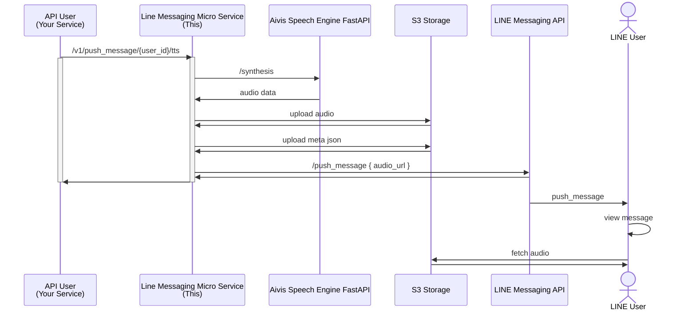

# LineMessagingMicroService

## Overview

- A microservice that wraps the LINE Messaging API, enabling text, image, and TTS-based audio messages with media storage on S3.
- Supports message types of
  - Simple Text
  - TTS Audio
  - Image
- Generates TTS audio by [Aivis Speech Engine](https://github.com/Aivis-Project/AivisSpeech-Engine) + [Aivis Speech Engine FastAPI](https://github.com/jhjcpishva/AivisSpeechFastAPI).
- Audio content uploaded to S3 Storage.
  - Must be available from user's device network and have `https` endpoint.

## Flow



## .env

```.env
LINE_CHANNEL_ACCESS_TOKEN=...

S3_STORAGE_HOST=localhost:9000
S3_STORAGE_ACCESS_KEY=...
S3_STORAGE_SECRET_KEY=...
S3_STORAGE_SECURE=false
S3_STORAGE_BUCKET_NAME=line-messaging-micro-service
S3_STORAGE_TTS_UPLOAD_PATH=/lmms/tts/
S3_STORAGE_IMAGE_UPLOAD_PATH=/lmms/image/
S3_STORAGE_PUBLIC_URL=https://localhost:9000/
# S3_STORAGE_PUBLIC_URL=https://___.ngrok-free.app

AIVIS_SPEECH_FAST_API_URL=http://localhost:8001/

PORT=8000
CONTEXT_PATH=/
```

## Documentation

- API documentation is available at `/docs` or `/redoc`.
- `POST /v1/push_message/{user_id}/text`: Send a simple text message to the specified user.
- `POST /v1/push_message/{user_id}/tts`: Send a TTS message to the specified user. The TTS message is generated by Aivis Speech Engine and uploaded to S3 Storage.
- `POST /v1/push_message/{user_id}/image`: Send an image message to the specified user. The image is uploaded to S3 Storage.

## Run

### Docker

```sh
docker run \
  -env-file .env \
  -p 8000:8000 \
  ghcr.io/jhjcpishva/line-messaging-micro-service:latest
```

### Docker Compose

```yaml
services:
  line-messaging-micro-service:
    # build: .
    image: ghcr.io/jhjcpishva/line-messaging-micro-service:latest
    env_file:
      - .env
    environment:
      - S3_STORAGE_HOST=minio:9000
      - AIVIS_SPEECH_FAST_API_URL=http://aivis-speech-fast-api:8000/
    ports:
      - "8000:8000"

  aivis-speech-fast-api:
    image: ghcr.io/jhjcpishva/aivis-speech-fast-api:latest
    environment:
      - AIVIS_SPEECH_ENGINE_URL=http://aivisspeech-engine:10101/
    depends_on:
      aivisspeech-engine:
        condition: service_healthy

  aivisspeech-engine:
    image: ghcr.io/aivis-project/aivisspeech-engine:cpu-latest
    volumes:
      - ./docker/aivisspeech-engine:/home/user/.local/share/AivisSpeech-Engine-Dev
    healthcheck:
      test: ["CMD", "curl", "-f", "http://localhost:10101/version"]
      interval: 5s
      timeout: 10s
      retries: 20

  # S3 storage
  minio:
    image: minio/minio:latest
    ports:
      - "9000:9000"
      - "9001:9001" # MinIO console port
    volumes:
      - ./docker/minio/data:/data
    command: server /data --console-address ":9001"
    healthcheck:
      test: ["CMD", "mc", "ready", "local"]
      interval: 10s
      timeout: 5s
      retries: 5
      start_period: 5s

```
